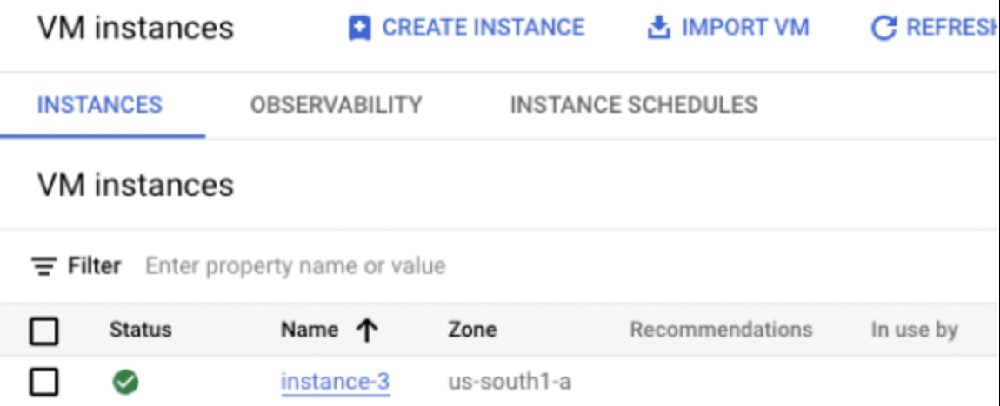
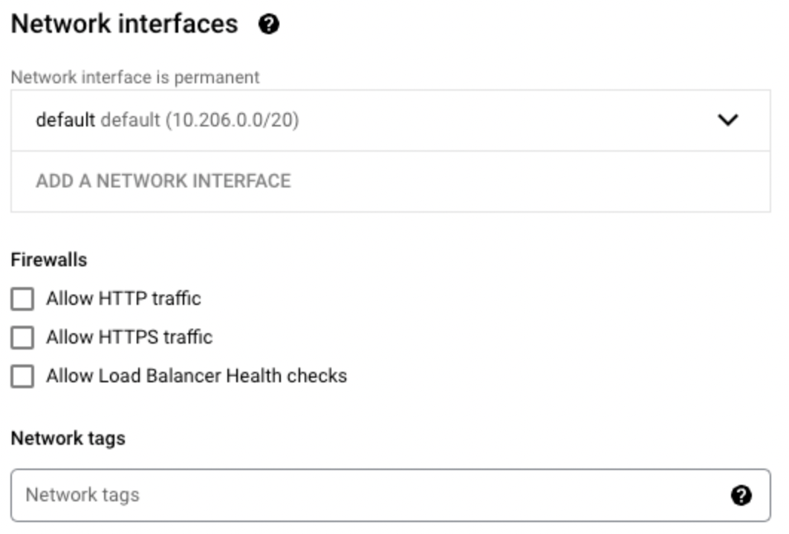
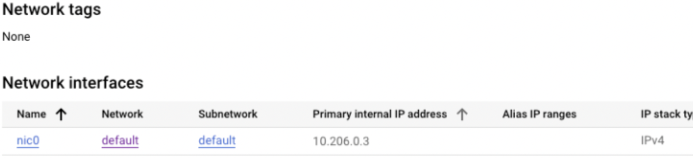
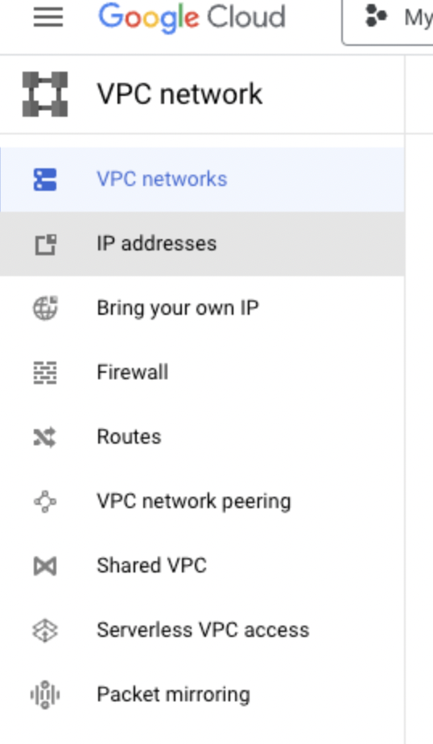
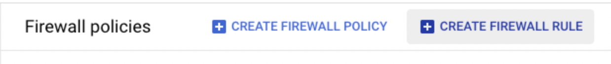
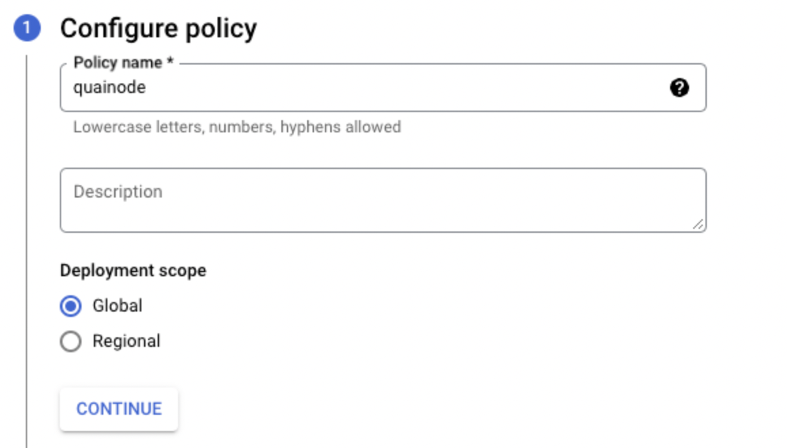
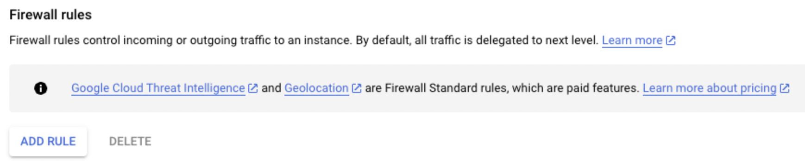
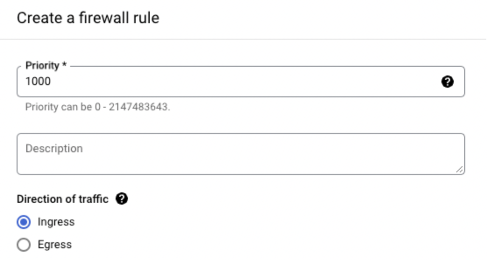
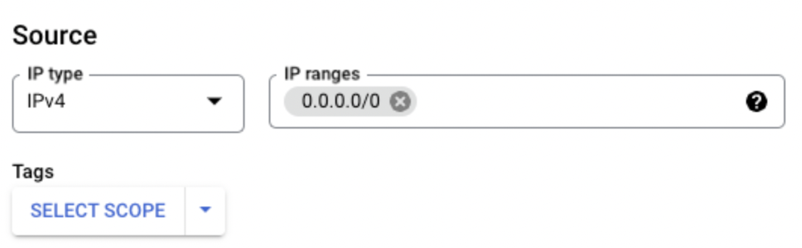
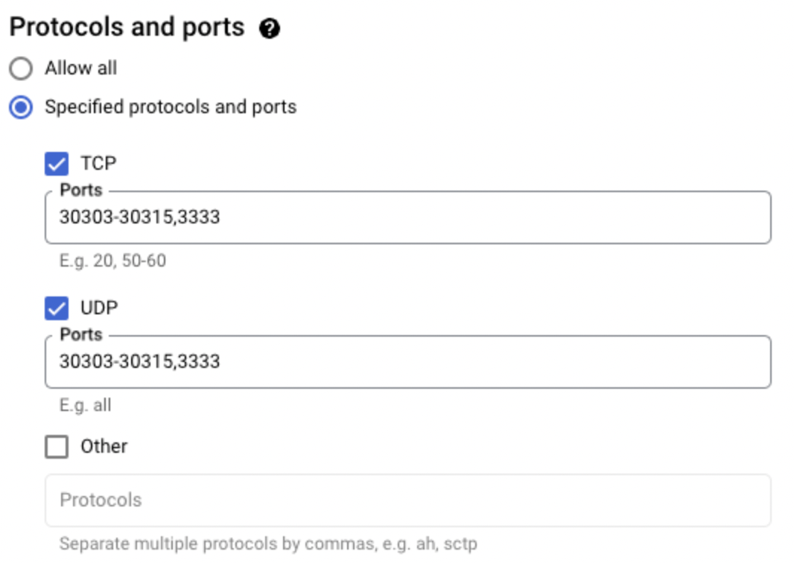

# Manual GCP Firewall Configuration

## Introduction

This tutorial details the process of manually creating a Google Cloud Platform firewall policy to run a Quai Network node and stratum proxy.

:::warning
The Quai Network [GCP one-click deploy](../gcp-auto.md) process automatically configures the following firewall policy on setup. **This tutorial is designed for manual firewall configuration only.**
:::

## Firewall Policies

To run an instance of a Quai Network node and proxy, we'll need to configure some firewall rules that will allow the node to connect to other nodes and the proxy to connect to a miner.

* Both global nodes and slice nodes require **TCP/UDP ports 30303 through 30315** to be open for inbound peer connections.
* The stratum proxy requires a single TCP/UDP port to be open to listen for inbound miner connections. For the purpose of this tutorial, we'll be **opening the default stratum port 3333** for incoming connections. If you'd like to run multiple proxies you'll need open further ports and [specify them in your proxy run command as a flag](../../../../stratum-proxy/run-stratum/run-stratum.md#run).

Opening the ports can be done by setting firewall rules within the GCP Compute Engine API. Start by navigating to your [Compute Engine dashboard](https://console.cloud.google.com/compute/instances).

Under the VM instances tab, select your VM instance that contains your deployed code.

After selecting your VM instance, select the edit button at the top of the page:

Scroll down to the network interfaces section and create a new network tag, it can be any name you chose.

After creating a new network tag, click save at the bottom of the page.

Once the save finishes, you'll be redirected back to your VM instance details page. Scroll down to the network interfaces section and select the option under "network". In the screenshot below, it is labeled as default.

On the next page, take a look at the left sidebar and select Firewall.

On the top center bar, select "Create Firewall Policy":

Under the configure policy section, **name your policy**. The specific name can be arbitrary, just make sure to remember it. Click continue.

In the next section, click the "Add Rule" button.

At the top of the rule details section, set a rule priority value. The value you set can be anything, and only matters if you have other firewall rules set that may conflict with the ones we're setting now.

Set the direction of traffic to "ingress".

Set the source IP ranges to `0.0.0.0/0` to allow traffic to all VMs with the specified tag. Insert the network tag you made earlier into the "Tags" section.

Lastly, set the protocols and ports toggle to the "Specified protocols and ports" option. Below, specify the TCP and UDP ports you'd like to open for connections. For our node and proxy to work properly, we'll need to open ports 30303-30315 and 3333.

Finally, click the create button at the bottom. **We've now successfully configured our GCP VM instance with the necessary firewall policy to run a Quai Network node and proxy.**