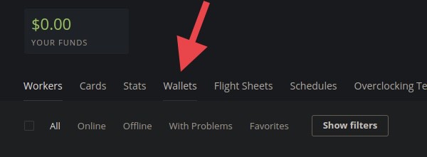
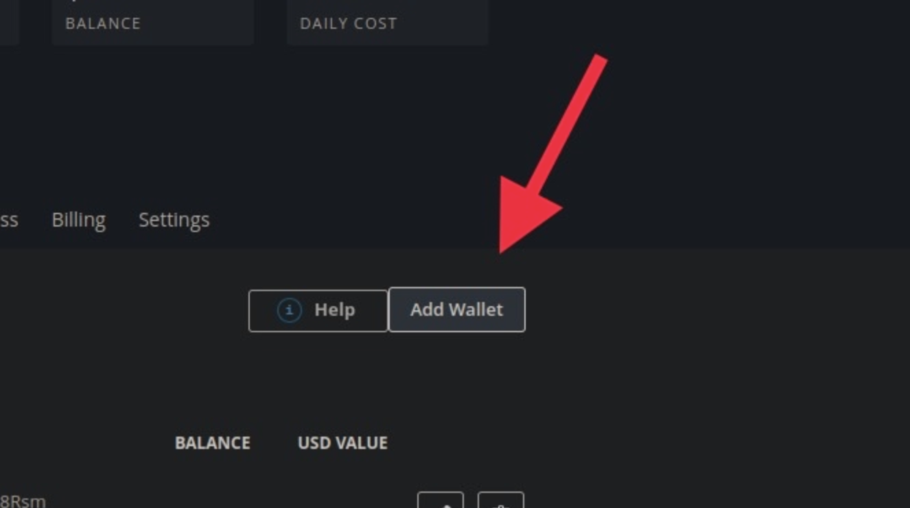
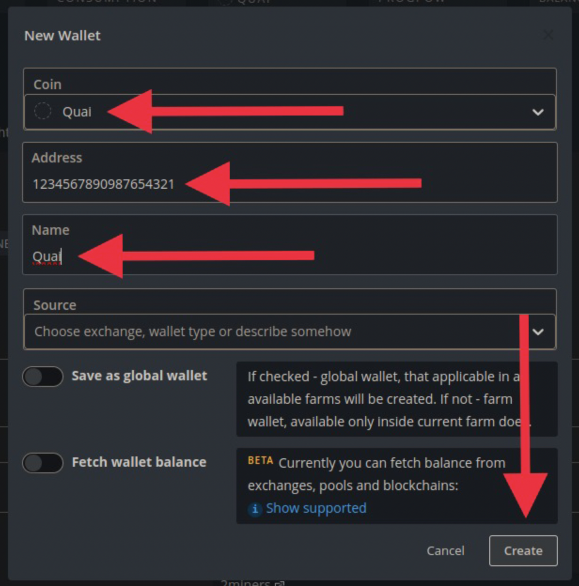
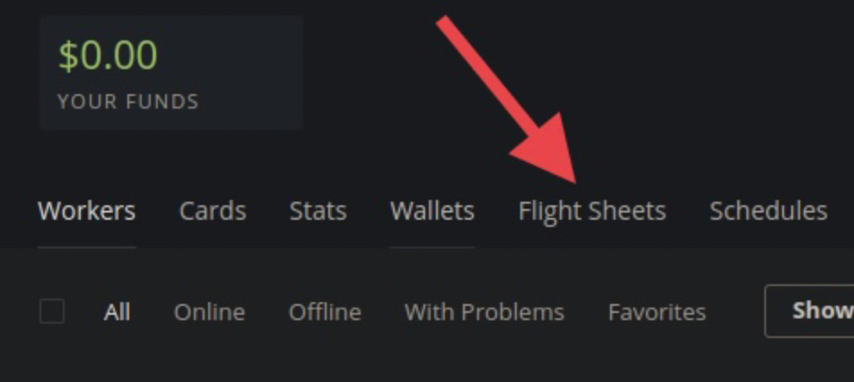
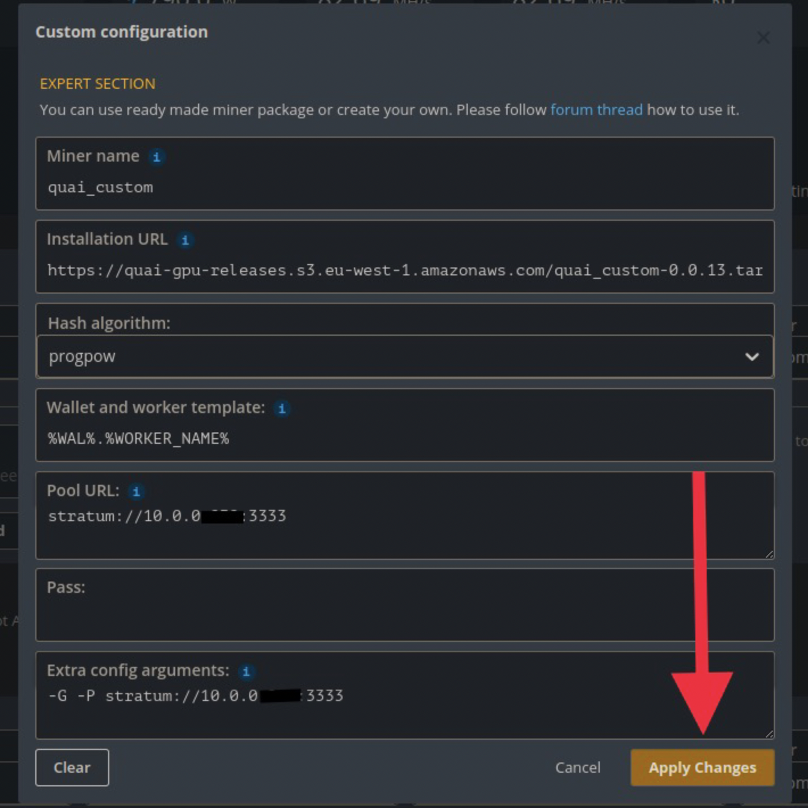

# GPU Miner FAQ

## Setup & Config

### Hashing Algorithm

**What hashing algorithm is used in the Iron Age Testnet?**

The Iron Age Testnet is running using the ProgPoW hashing algorithm for mining. The ProgPoW algorithm was chosen due to the difficulty of creating application-specific integrated circuits (ASICs) that can mine ProgPoW. The use of ASIC-able algorithms such as SHA-256 quickly renders consumer-grade hardware impractical, resulting in large barrier to entry for competitive mining.

ProgPoW was developed as an EIP to replace Ethash, but was discarded due to the merge. The original ProgPoW EIP (EIP-1057) can be found [here](https://github.com/ethereum/EIPs/pull/1057). Additional information on ProgPoW can be found on the ETH Magicians forum [here](https://ethereum-magicians.org/t/progpow-a-compilation-of-reference-material/3040/3).

### Miner Hardware Specs

**What are the hardware requirements for a GPU miner?**

To run a GPU miner, you’ll need:

* A node running a stratum proxy to connect to
* An AMD or Nvidia GPU
* An AMD or Intel CPU
* 4 GB+ of RAM

### Coinbase Addresses

**Can I input the same address to mine to for all of the coinbase addresses in my node's network.env?**

No. Within any node's network.env, each coinbase address must be unique and properly map to the shard it has been inputted for. You can learn more about how Quai Network uses a sharded address structure [here](../../../../learn/advanced-introduction/hierarchical-structure/sharding.mdx).

### Mining OS

**What operating systems are supported by the quai-gpu-miner?**

Currently, Ubuntu (Version 20.04) and HiveOS are the only operating systems supported by the miner.

### Installation Script

**Is there a script I can use to set up my miner automatically?**

There is a script to build the miner supported on HiveOS! To use the script, you can run the following commands in your HiveOS terminal:

```bash
sudo selfupgrade
```

```bash
curl -fsSL https://raw.githubusercontent.com/dominant-strategies/quai-gpu-miner/main/miner_deploy_script.sh | bash
```

Running this command will build and install all the necessary prerequisites for the miner. After this script has finished running, you can point your miner at your stratum proxy and start hashing with the following commands:

```bash
cd /home/user/quai-gpu-miner/build
```

```bash
./ethcoreminer/ethcoreminer -G -P stratum://YOURPROXYIPADRESS:STRATUMPORT
```

### Dedicated Hardware

**Does my miner have to be running on the same machine as my node?**

No. While you can connect the GPU miner to a node on the same machine, it is recommended to run the GPU miner and a node on separate machines, using the stratum proxy to point the miner at the node.

## Errors

### Mining Pre-Sync

**What happens if I start mining before my node is synced?**

If you start mining before your node is synced, you will be mining a fork of the network. This will cause you to mine blocks that **all other nodes will reject, wasting hashrate**. Additionally, if your node repeatedly propagates blocks that other nodes consider to be invalid, you run the risk of being dropped as a peer, which would cause your node to never sync to the network.

:::danger
**Do not mine to a node that is not already synced to the tip of the network.**
:::

### Error on Make and/or Build

**I am getting errors on the make and/or build step of setting up the quai-gpu-miner. How do I fix this?**

The most common cause of errors on the make and/or build step of setting up the quai-gpu-miner are running on an unsupported operating system. Be sure you're running on either Ubuntu 20.04 or HiveOS.

### No OpenCL Platforms Found / No Usable Mining Devices

**I got the error "Error: No usable mining devices found." How do I fix this?**

There are two likely causes of this error on bare-metal:

* You're running your miner in a virtual machine on top of Windows. Virtual machines on Windows don’t have access to the GPU or its drivers. To get the miner to work, you'll have to boot Linux or Hive, not run a VM.
* You're dual booting using secure boot. If you are dual booting, be sure you've turned off secure boot in your BIOS to ensure that both operating systems can access your GPU.

If the issue is on a VPS rather than bare-metal, installing `nvidia-cuda-toolkit` may help detect the GPU(s).

1. `sudo apt install nvidia-cuda-toolkit`
2. `sudo apt update && sudo apt upgrade -y`
3. `sudo apt install -y git cmake build-essential mesa-common-dev`
4. `sudo reboot`
5. Re-join the mining guide starting from [configure and run](../hive-manual/hive-manual.md).

### SIGSEGV

**I got the error "SIGSEGV encountered..." and my miner crashed. How do I fix this?**

The Dominant Strategies team is actively investigating the source of this error/crash. If you have experienced this error, we would greatly appreciate your submission of the following form to assist in our triaging of the issue: [https://quai.typeform.com/sigsegv](https://quai.typeform.com/sigsegv).

Some notes on troubleshooting this issue while we continue to investigate:

* Try upping the voltage and dropping the core clock of your GPU(s). This will cause your GPU(s) to run in a more stable state, but also reduce the efficiency of the miner. It may be worth testing to see if running in a less-efficient, more-stable manner resolves the issue.
* If you are still experiencing the SIGSEGV issue while running at high voltage and low core clock speeds, you should start looking into your GPU's drivers.
* If you are not able to resolve the issue via the above suggestions, get in contact with our team via the [Quai Dev Discord](https://discord.gg/s8y8asPwNC) to share more information about your specific issue.

### AMD Low Hashrate

**I am getting significantly lower hashrate than expected on AMD cards. How do I fix this?**

Our team has noticed that many AMD graphics cards give significantly lower hashrate than expected when mining ProgPoW. The likely cause is that AMD builds are not currently optimized for ProgPoW. One troubleshooting tip to try is looking into the graphics-card-specific drivers and installing them for your GPUs. However, this may still not resolve your issue.

At some point in the future, a more optimized quai-gpu-miner build for AMD cards will be released that addresses this discrepancy between expected and real hashrate.

## Optimization

### Flight Sheet

**Is there a Quai mining flight sheet for use with HiveOS?**

There is a community-made flight sheet, but not one directly from the Dominant Strategies team. You can set up with a Quai mining flight sheet created by a Quai community member by following these instructions:

:::warning
This flight sheet was created and is maintained by a Quai community member, not the Dominant Strategies team. While it has been tested by our team before being put in this documentation, use of this flight sheet is at your own risk.
:::

1. In the "workers" menu, click "wallets".



2. On the right side of the page, click "add wallet".



3. On "Coin" field, type "Quai" then click on "Create Quai" in the drop-down menu.
4. On "Address" field, copy/paste your wallet address.
5. On "Name" field, type a name for your wallet.
6. On bottom right corner, click "Create".



7. In the "workers" menu, click "flight sheets".



8. On "Miner name", type "quai\_custom".
9. On "Installation URL", copy/paste "[https://quai-gpu-releases.s3.eu-west-1.amazonaws.com/quai\_custom-0.0.13.tar.gz](https://quai-gpu-releases.s3.eu-west-1.amazonaws.com/quai\_custom-0.0.13.tar.gz)".
10. On "Hash algorithm", type "progpow".
11. On "Wallet and worker template", type "%WAL%.%WORKER\_NAME%".
12. On "Pool URL", type "stratum://EXTERNALIPADDRESS:PORT".
13. On "Extra config arguments", type "-G -HWON 1 -P stratum://EXTERNALIPADDRESS:PORT".
14. On bottom right corner, click "Apply Changes".



15. Deploy flight sheet.

### Slice Choice

**Which slice should I mine?**

There are two major factors that miners should consider when deciding which slice of the network to mine in the Iron Age Testnet:

1. Difficulty - during the Iron Age, Mainnet Rewards for mining are determined based on each address's proportion of total blocks mined. Thus, miners are consistently incentivized to mine the lowest-difficulty slice of the network. The slice that has the lowest difficulty will change over time as miners come online and move their hashrate around; to find which chain currently has the lowest difficulty, you can check the [Quai Stats](https://stats.quai.network/) page.
2. Latency - if all slices of the network are operating at approximately the same difficulty, miners may still be able to gain an additional advantage by selecting the slice of the network they have the lowest latency to. This will minimize a miner's chances of proposing blocks that get uncled, reducing wasted hashrate. Latency is a secondary optimization to difficulty -- it is up to miners to determine at what point they believe they can benefit from considering latency and which slice they have the lowest latency to.

### Tuning

**How should I tune my GPUs to optimize for ProgPoW?**

:::danger
Tuning GPUs has certain risks you should be aware of:

* Improperly tuned GPUs can result in crashes and system instability.
* Tuning/changing certain settings may void the warranty of your GPU.
* Tuning improperly can cause damage to your GPUs. Always research the limits and specs of your specific cards.

Proceed with tuning at your own risk!
:::

Tuning GPUs for optimal performance with the ProgPoW algorithm can be done in HiveOS. ProgPoW is a highly memory intensive algorithm. We have seen success from community members and internally by tweaking the following settings:

1. Increasing memory clock.
2. Reducing core clock.
3. You can additionally explore over/under-volting, but this will require special tools and cannot be done through HiveOS.
